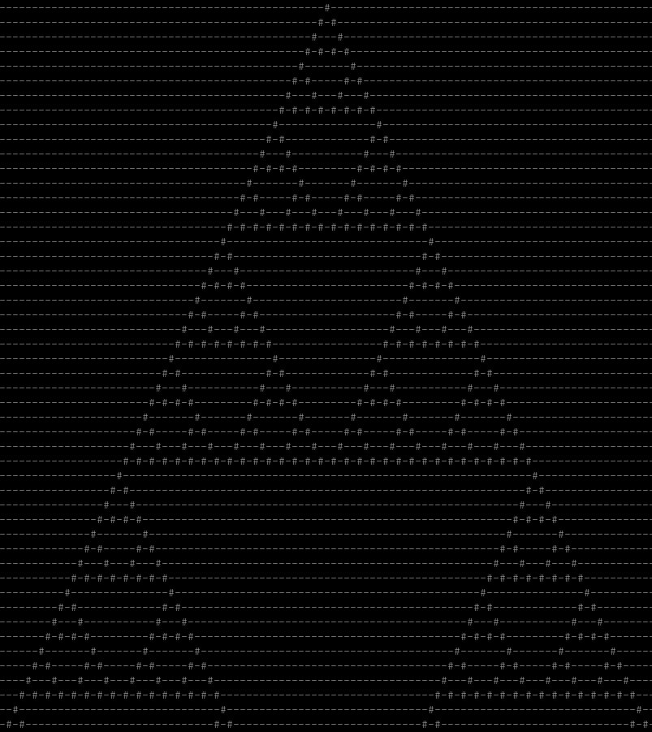

# hs-cellular-automata

A little 1D cellular automata simulator I wrote in Haskell. It prints the simulated rows in your console. The simulator is approximately ~30 lines of code, and it comes with [Rule 75](https://atlas.wolfram.com/01/01/75/) and [Rule 18](https://atlas.wolfram.com/01/01/18/) already written.

I wrote this to see how much I like Haskell (it's pretty cool), and also to begin exploring more complex cellular automata. I'll probably leave this repository as it is, but I do intend on creating future projects of more complex cellular automata. 

## How to run
To run this project:
1. Clone the repository
2. Run `cabal run`

Note: if you don't have `cabal` installed then I recommend installing it through [GHCup](https://www.haskell.org/ghcup/). It makes it super easy to install Haskell and a build system for it.
